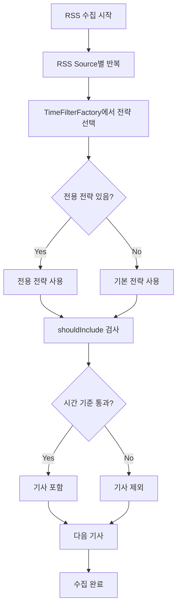

# RSS별 시간 필터링 Strategy Pattern 구현

**작성일**: 2025-08-24  
**목적**: 오래된 RSS 기사 필터링을 위한 확장 가능한 Strategy Pattern 구현

---

## 🎯 문제 상황

RSS에서 수집한 기사 중 오래된 내용을 거르고 싶다는 요구사항이 있었습니다. 하지만 단순히 하나의 기준을 적용하기보다는:

1. **RSS 플랫폼별로 다른 기준** 적용하고 싶음
2. **확장성** 있게 새로운 RSS 소스 추가 시 개별 정책 설정 가능
3. **기본 정책**과 **개별 정책** 모두 지원

---

## 🏗️ 설계 방향

### Strategy Pattern 선택 이유

```
RssTimeFilterStrategy (interface)
├── DefaultRssTimeFilterStrategy (기본 구현체)
├── InvestingComTimeFilterStrategy (Investing.com 전용)
├── BbcTimeFilterStrategy (BBC 전용)
└── [확장 가능한 구조]
```

**장점:**
- ✅ **확장성**: 새 RSS 소스마다 전용 전략 쉽게 추가
- ✅ **유연성**: 각 RSS별 다른 시간 기준, 로직 적용 가능
- ✅ **유지보수성**: 기존 코드 수정 없이 새 전략 추가
- ✅ **테스트 용이**: 각 전략별 독립적 단위 테스트 가능

---

## 📋 구현 내용

### 1. 핵심 인터페이스

```java
public interface RssTimeFilterStrategy {
    boolean supports(String rssSourceCode);           // RSS 지원 여부
    boolean shouldInclude(Article article, String rssSourceCode);  // 포함 판단
    int getMaxAgeHours(String rssSourceCode);        // 최대 허용 시간
    String getStrategyName();                         // 전략명 (로깅용)
}
```

### 2. 구현체별 특화된 정책

#### DefaultRssTimeFilterStrategy
- **대상**: 전용 전략이 없는 모든 RSS 소스
- **기준**: 24시간 (설정 가능)
- **특징**: `app.rss.enableTimeFilter=false`로 완전 비활성화 가능

#### InvestingComTimeFilterStrategy  
- **대상**: `investing_*` 코드 RSS들
- **기준**: 
  - `investing_news`: 12시간 (일반 뉴스)
  - `investing_market`: 6시간 (시장 현황, 실시간성 중요)
  - `investing_commodities`: 8시간 (원자재 정보)
- **특징**: 실시간 금융 정보 특성에 맞춘 짧은 기준

#### BbcTimeFilterStrategy
- **대상**: `bbc_business` 코드 RSS
- **기준**: 48시간
- **특징**: 심층 분석 기사 특성상 긴 유효 기간

### 3. Strategy Factory 패턴

```java
@Component
public class RssTimeFilterStrategyFactory {
    // 모든 전략 자동 주입
    @Autowired
    private List<RssTimeFilterStrategy> allStrategies;
    
    // RSS 소스별 최적 전략 반환
    public RssTimeFilterStrategy getStrategy(String rssSourceCode) {
        // 전용 전략 우선 검색 → 없으면 기본 전략
    }
}
```

### 4. RSS 수집 단계 통합

**RssFeedService.parseFeed()** 메서드에서 실시간 적용:

```java
private List<ArticleDto> parseFeed(SyndFeed feed, RssSourcesConfig.RssSource source) {
    RssTimeFilterStrategy strategy = timeFilterFactory.getStrategy(source.getCode());
    
    for (SyndEntry entry : feed.getEntries()) {
        // 기사 파싱
        Article tempArticle = new Article(source.getCode(), url, title);
        tempArticle.setPublishedAt(publishedAt);
        
        // 시간 필터링 적용
        if (strategy.shouldInclude(tempArticle, source.getCode())) {
            articles.add(articleDto);  // 포함
        } else {
            filteredCount++;  // 제외
        }
    }
}
```

---

## ⚙️ 설정 추가

### application.yml
```yaml
app:
  rss:
    enableTimeFilter: ${RSS_TIME_FILTER:true}  # 전역 활성화/비활성화
    defaultMaxAgeHours: ${RSS_DEFAULT_MAX_AGE:24}  # 기본 기준시간
```

### RssSourcesConfig.RssSource
- **추가된 필드**: `code` (전략 식별용)
- **기존 필드**: `name`, `url`, `enabled` 등 유지

---

## 🧪 테스트 전략

### 단위 테스트 (RssTimeFilterStrategyTest)

각 전략별 테스트 케이스:

1. **시간 기준 테스트**
   - 기준 시간 내 기사 → `shouldInclude() = true`
   - 기준 시간 초과 기사 → `shouldInclude() = false`

2. **전략 선택 테스트**
   - `supports()` 메서드로 올바른 RSS 코드 매칭 확인

3. **예외 상황 테스트**
   - `publishedAt = null` → 항상 포함 (안전한 기본 동작)

4. **전략별 차별화 테스트**
   - InvestingCom: 시장 정보 6시간 vs 일반 뉴스 12시간
   - BBC: 48시간 긴 기간 vs 기본 24시간

**테스트 결과**: ✅ 8개 테스트 모두 통과

---

## 🔄 통합 흐름



---

## 📊 실제 적용 예시

현재 10개 RSS 소스별 적용되는 시간 기준:

| RSS 소스 | 전략 | 기준 시간 | 이유 |
|---------|------|----------|------|
| `investing_market` | InvestingCom | 6시간 | 실시간 시장 현황 |
| `investing_news` | InvestingCom | 12시간 | 금융 뉴스 |
| `investing_commodities` | InvestingCom | 8시간 | 원자재 정보 |
| `bbc_business` | BBC | 48시간 | 심층 분석 기사 |
| `ft_companies` | Default | 24시간 | 일반 비즈니스 뉴스 |
| `marketwatch` | Default | 24시간 | 일반 비즈니스 뉴스 |
| `bloomberg_economics` | Default | 24시간 | 일반 비즈니스 뉴스 |
| `economist` | Default | 24시간 | 일반 비즈니스 뉴스 |
| `kotra_overseas` | Default | 24시간 | 일반 비즈니스 뉴스 |
| `maeil_securities` | Default | 24시간 | 일반 비즈니스 뉴스 |

---

## 🚀 향후 확장 방안

### 1. 추가 전략 구현 예시
```java
@Component
public class BloombergTimeFilterStrategy implements RssTimeFilterStrategy {
    // Bloomberg 특화 로직 (예: 시장 시간 고려)
}
```

### 2. 고급 필터링 로직
- 시장 개장/폐장 시간 고려
- 주말/공휴일 다른 기준 적용
- 기사 카테고리별 차등 적용

### 3. 동적 설정
- 데이터베이스나 외부 API에서 시간 기준 동적 로딩
- A/B 테스트를 위한 기준 실시간 변경

---

## 📈 성능 영향

### 긍정적 영향
- ✅ **메모리 절약**: 오래된 기사 조기 제외로 후속 처리 부하 감소
- ✅ **처리 속도**: 불필요한 본문 추출, AI 요약 작업 제거
- ✅ **품질 향상**: 최신 정보 위주 수집으로 뉴스 품질 개선

### 성능 오버헤드
- 전략 선택 비용: 캐싱으로 최소화
- 시간 비교 연산: negligible

---

## 🧠 배운 점

### 1. Strategy Pattern의 실용성
- 인터페이스 설계가 얼마나 중요한지 실감
- Factory 패턴과의 조합으로 확장성 극대화

### 2. RSS별 특성 이해
- 금융 뉴스: 실시간성 중요 → 짧은 기준
- 분석 기사: 유효 기간 길음 → 긴 기준
- 플랫폼별 콘텐츠 성격 차이 고려 필요

### 3. 설정의 유연성
- 환경변수로 전역 on/off 제어
- 코드 변경 없이 정책 조정 가능한 구조

### 4. 테스트 주도 개발
- 전략별 독립 테스트로 안정성 확보
- Mock 없이도 충분한 단위 테스트 가능

---

## 🔧 개발 시 발생한 이슈와 해결

### 1. RssSource.getCode() 메서드 부재
**문제**: application.yml에는 `code` 필드가 있지만 Java 클래스에는 없었음  
**해결**: RssSourcesConfig.RssSource에 `code` 필드와 getter/setter 추가

### 2. 시간 필터링 적용 시점
**고려사항**: S1_FETCH vs S2_EXTRACT vs 데이터베이스 레벨  
**선택**: S1_FETCH 단계에서 조기 필터링 (성능상 최적)

### 3. null publishedAt 처리
**정책**: 발행일이 없으면 일단 포함 (안전한 기본값)  
**이유**: RSS 파싱 오류로 누락된 유효 기사 보호

---

**💡 결론**: Strategy Pattern을 통해 확장 가능하고 유지보수성 높은 RSS 시간 필터링 시스템을 구현했습니다. 각 RSS 플랫폼의 특성을 고려한 개별 정책 적용으로 뉴스 품질과 처리 효율을 동시에 개선할 수 있었습니다.